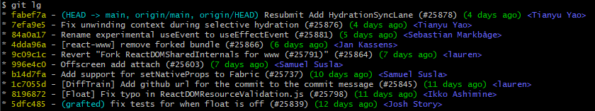

# Git Aliases

This is my personal git aliases I use. Some I picked up, some created and some stolen from [durdn](https://github.com/durdn/cfg/blob/master/.gitconfig) (Check him out. He has a lot of cool aliases that I don't fit my use cases but might fit yours).

Feel free to read through them in [.gitconfig](.gitconfig) (I gave a description for some of them in [#What they do?](#what-they-do)). Or go straight to [adding them](#how-to-use) to your config file.

## What they do?

Most of them are simple shortcuts

```ini
    ci = commit
    cl = clone
    br = branch
```

Some with parameters or sub commands

```ini
    cian = commit --amend --no-edit

    cob = checkout -tb

    st = status -sb

    sl = stash list

    po = push -u origin HEAD
```

### Fancier aliases

- [git um](#git-um)
- [git lsa](#git-lsa)
- [git qc](#git-qc)
- [git lc](#git-lc)
- [git lg](#git-lg)

#### git um

> update master/main

checkout master or main (which ever is present) and pull

Expanded:

```bash
!(git checkout master || git checkout main) && git pull -r
```

#### git lsa

> ls aliases

Expanded:

```bash
!git config -l \| grep alias \| cut -c 7- \| awk -F= '{first=$1;$1=\"\";printf(\"%-12s %s\\n\",first,$0);}'"
```

<details>

<summary>Output:</summary>

```bash
$ git lsa
ci            commit
cia           commit --amend
cian          commit --amend --no-edit
cim           commit -m
co            checkout
cob           checkout -tb
st            status -sb
cl            clone
br            branch
r             reset
cp            cherry-pick
gr            grep -Ii
s             stash
sl            stash list
sa            stash apply
ss            stash save
lasttag       describe --tags --abbrev 0
lt            describe --tags --abbrev 0
p             push
po            push -u origin HEAD
um            !(git checkout master || git checkout main) && git pull -r
lsa-raw       !git config -l | grep alias | cut -c 7-
lsa           !git lsa-raw  | awk -F  '{first $1;$1 "";printf("%-12s %s\n",first,$0);}'
lsal          !git lsa-raw  | awk -F  '{first $1;$1 "";printf("%12s %s\n",first,$0);}'
qc            !f() { git stash && git um && git co -tb $1 && git stash pop && git add . && git ci -m '${1}: ${2}' -m '' -m '${3:-desc}' && git ci --amend; } ; f
empty         !git commit -am"[empty] Initial commit" --allow-empty
lightclone    !echo -e '!--------------------!
lc            lightclone
logg          log --graph --oneline --decorate
logga         log --graph --oneline --decorate
lg            log --color --graph --pretty format:'%C(yellow)%h%Creset -%C(cyan)%d%Creset %s %Cgreen(%cr) %C(bold blue)<%an>%Creset' --abbrev-commit
lga           !git lg --all
```

</details>

Alternatives:

- `git lsa-raw`: no formatting
- `git lsal`:  left padding for the alias name

    ```text
          lg  log --color --graph --pretty format:'%C(yellow)%h%Creset -%C(cyan)%d%Creset %s %Cgreen(%cr) %C(bold blue)<%an>%Creset' --abbrev-commit
         lga  '!git lol --all'
    ```

#### git qc

> quick commit

Parameters:

1. Feature Name/Ticket Name: used in branch name and commit message
2. Commit message (optional)
3. Commit Description (optional)

Expanded:

```bash
"!f() { git stash && git um && git co -tb \"$1\" && git stash pop && git add . && git ci -m \"${1}: ${2}\" -m '' -m \"${3:-desc}\"; } ; f"
```

Buckle Up!

1. stash
2. checkout and update master ([git um](#git-um))
3. create a new branch with the given ticket name
4. pop stash
5. add all
6. commit using parameters

#### git lc

> light clone

alias: `git lightclone`

Only use this for checking out a repo you just found. Using `depth` when cloning a repo for development can lead to unexpected behavior.

Expanded:

```bash
echo XXXX && git clone --depth 10 --single-branch
```

Example:

Normal:

```bash
$ git clone https://github.com/facebook/react.git
Cloning into 'react'...
remote: Enumerating objects: 215295, done.
Receiving objects:  17% (37309/215295), 40.29 MiB | 3.07 MiB/s

# ctrl c
```

light clone:

```bash
$ git lc https://github.com/facebook/react.git
!--------------------!
Depth is set to 10!
Can lead to UNEXPECTED behaviour.
Useful if you are only checking out repo, not using it for development
!--------------------!
Cloning into 'react'...
remote: Enumerating objects: 2827, done.
remote: Counting objects: 100% (2827/2827), done.
remote: Compressing objects: 100% (2334/2334), done.
remote: Total 2827 (delta 699), reused 1043 (delta 383), pack-reused 0
Receiving objects: 100% (2827/2827), 5.91 MiB | 656.00 KiB/s, done.
Resolving deltas: 100% (699/699), done.
```

#### git lg

> log

`git log` with custom formatting (one liners, relative time from commit, author name).

Expanded:

```bash
log --color --graph --pretty=format:'%C(yellow)%h%Creset -%C(cyan)%d%Creset %s %Cgreen(%cr) %C(bold blue)<%an>%Creset' --abbrev-commit
```

Output:



## How to use?

You can either copy the content of [.gitconfig](.gitconfig) to your `~/.gitconfig`. Or execute [add_aliases.sh](add_aliases.sh) to add them to your `~/.gitconfig`.

To learn more about how the [add_aliases.sh](add_aliases.sh) was generated, Checkout [Github Action](#github-action) section.

## Github Action

uses [update_aliases.sh](update_aliases.sh) to update [add_aliases.sh](add_aliases.sh) on push.

Steps:

1. Checkout code.
2. Generate a new [add_aliases.sh](add_aliases.sh) script from [.gitconfig](.gitconfig) using [update_aliases.sh](update_aliases.sh).
3. Compare the newly generated [add_aliases.sh](add_aliases.sh) file with the one already present.
4. If there's a difference
    1. Replace old [add_aliases.sh](add_aliases.sh) with the updated one
    2. Commit the update.
